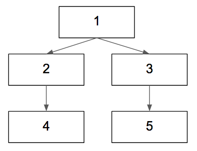
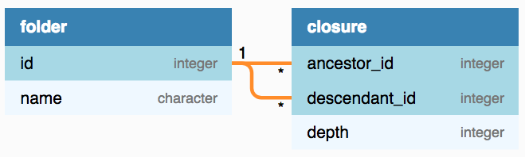
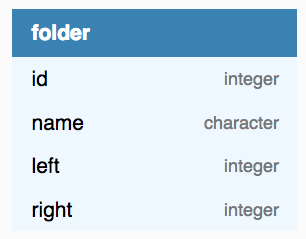
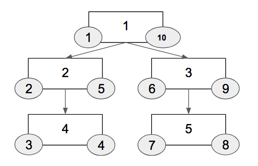
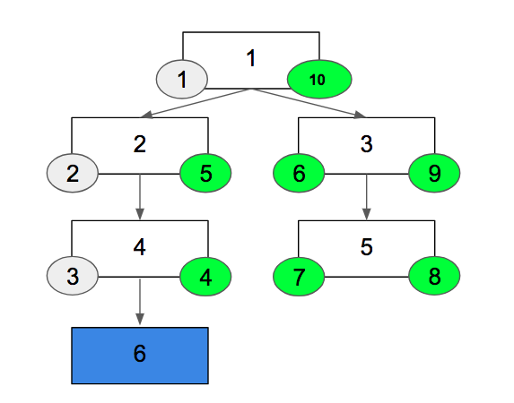
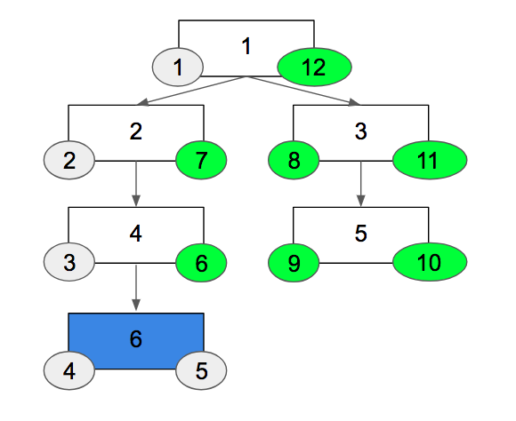

---
Hierarchical data in relational database
---
### Agenda
* @color[#D33682](Introduction)
* Adjacency list
* Closure table
* Nested set
* Database specific implementations
* Conclusion
+++
### Part 1: Introduction
* What is hierarchical data?
* Why stores in relational database?
* Common ways to store hierarchical data in relational database
+++
### What is hierarchical data?
Data that has parent-child relationship such as

* File system: directory - child
* Forum post
+++
### File system

+++
### Forum post

+++
### Why stores in relational database?
* No additional database needed
* Can join together with other types of relational data
+++
### Operations
* Insert/move/delete
* Query parents/children
* Query ancestors/descendants
+++
## Common strategies
* Adjacency list
* Closure table
* Nested set
+++
### End of part 1
---
### Agenda
* Introduction
* @color[#D33682](Adjacency list)
* Closure table
* Nested set
* Conclusion
+++
### Part 2: Adjacency list
+++
@snap[north-west left]
<h4>Structure</h4>
<ul>
    <li>Each node has a pointer to its' parent</li>
    <li>Storage cost: 1 extra column</li>
</ul>
@snapend

@snap[north-east diagram]

@snapend

@snap[south-west diagram]

@snapend

@snap[south-east]
<table>
<tr>
    <th>ID</th>
    <th>Parent ID</th>
</tr>
<tr>
    <td>1</td>
    <td>NULL</td>
</tr>
<tr>
    <td>2</td>
    <td>1</td>
</tr>
<tr>
    <td>3</td>
    <td>1</td>
</tr>
<tr>
    <td>4</td>
    <td>2</td>
</tr>
<tr>
    <td>5</td>
    <td>3</td>
</tr>
</table>
@snapend
+++
### Insert/Move
Insert a new node

    insert into folder (id, parent_id) values(5, 3)

Move a node to a different parent

    update folder set parent_id = 2 where id = 5
+++
### Query children/parent
Children

    select id from folder where parent_id = X

Parent

    select id from folder where id = X.parent_id
+++
### Ancestors/Descendants
Need to loop and send multiple queries, or...
+++
### Recursive CTE
* Supported by:
    * PostgreSQL 8.4 (2009)
    * MySQL 8.0 (2017)
    * Oracle 11g Release 2 (2009)
    * SQL Server 2005 (2005)
	* SQLite 3.8.3.1 (2014)
	* IBM DB2 UDB 8 (2002)
+++
### Get descendants (PostgreSQL)
Get all descendants of X:

    with recursive tree (id) as (
      select F.id from folder F
      where F.parent_id = X.id
      union
      select F.id from folder F, tree T
      where F.parent_id = T.id
    )
    select * from tree;
+++
### Get ancestors (PostgreSQL)

    with recursive tree (id, path) as (
      select F.parent_id as id, array[F.parent_id]::integer[] as path
      from folder F
      where id = X.id
      union
      select F.parent_id, tree.path || F.parent_id
      from folder F
      join tree on tree.id = C.id
    ) select path from tree
    where id = 0
+++
### Performance
* Insert/move/delete: fast
* Get ancestors/descendants: acceptable (with recursive CTE)
+++
### When to use
* A lot of mutations: Insert/move/delete
* Don't require super fast ancestors/descendants query
+++
### End of part 2
---
### Agenda
* Introduction
* Adjacency list
* @color[#D33682](Closure table)
* Nested set
* Conclusion
+++
### Part 3: Closure table
+++
### Structure
A separate table called "closure table" that stores all paths from each node to another

+++
@snap[west diagram]

@snapend
@snap[east]
<table>
<tr>
    <th>Ancestor</th>
    <th>Descendant</th>
    <th>Depth</th>
</tr>
<tr>
    <td>1</td>
    <td>2</td>
    <td>1</td>
</tr>
<tr>
    <td>1</td>
    <td>3</td>
    <td>1</td>
</tr>
<tr>
    <td>1</td>
    <td>4</td>
    <td>2</td>
</tr>
<tr>
    <td>1</td>
    <td>5</td>
    <td>2</td>
</tr>
<tr>
    <td>2</td>
    <td>4</td>
    <td>1</td>
</tr>
<tr>
    <td>3</td>
    <td>5</td>
    <td>1</td>
</tr>
</table>
@snapend
+++
### Insert

    insert into folder (id, name);

    insert into closure (ancestor_id, descendant_id, depth)
    select ancestor_id, <id>, depth + 1 from closure
    where descendant_id = <parent_id>;
+++
### Move
Move `<id>` to under `<new_parent_id>`

    delete from closure
	where descendant_id = <id> and ancestor_id != <id>;

    insert into closure (ancestor_id, descendant_id, depth)
    select ancestor_id, <id>, depth + 1 from closure
    where descendant_id = <new_parent_id>;
+++
### Delete

    delete from closure where descendant_id = <id>
+++
### Query children

    select F.id, F.name
    from folder F left join closure C on ancestor_id = id
    where C.depth = 1
+++
### Query parent

    select F.id, F.name
    from folder F left join closure C on descendant_id = id
    where C.depth = 1
+++
### Ancestors

    select F.id, F.name
    from folder F left join closure C on descendant_id = id
    order by C.depth
+++
### Descendants

    select F.id, F.name
    from folder F left join closure C on ancestor_id = id
    order by C.depth
+++
### Performance
* Insert/move/delete: fast but not as fast as adjacency list
* Get ancestors/descendants: fast
+++
### When to use
* A lot of mutations: Insert/move/delete
* Extra storage cost for the closure table is fine
+++
### End of part 3
---
### Agenda
* Introduction
* Adjacency list
* Closure table
* @color[#D33682](Nested set)
* Conclusion
+++
### Part 4: Nested set
+++
### Structure
Extra 2 columns: `left` and `right`

+++
@snap[north-west diagram]

@snapend

@snap[north-east]
<table>
<tr>
    <th>ID</th>
    <th>Left</th>
    <th>Right</th>
</tr>
<tr>
    <td>1</td>
    <td>1</td>
    <td>10</td>
</tr>
<tr>
    <td>2</td>
    <td>2</td>
    <td>5</td>
</tr>
<tr>
    <td>3</td>
    <td>6</td>
    <td>9</td>
</tr>
<tr>
    <td>4</td>
    <td>3</td>
    <td>4</td>
</tr>
<tr>
    <td>5</td>
    <td>7</td>
    <td>8</td>
</tr>
</table>
@snapend

@snap[south-west diagram]
Rule: descendants' left and right numbers are between ancestor's numbers
@snapend
+++
### Insert

+++
### Insert (cont)

+++
### Insert (cont)
Insert under (id, left, right) of (4, 3, 4)

	update folder
	set left =
		case when left > <parent.left> then left + 2 else left end,
		right = right + 2
	where right > <parent.left>;

	insert into folder (6, <parent.left> + 1, <parent.left> + 2)
+++
### Move
+++
### Delete
+++
### Children
+++
### Parent
+++
### Query ancestors

	select A.id, A.name from folder D
	join folder A
	on D.left between A.left and A.right
	where D.id = <id>
+++
### Query descendants

	select C.id, C.name from folder A
	join folder D
	on D.left between A.left and A.right
	where A.id = <id>
+++
### Performance
* Insert/move/delete: slow
* 
+++
### When to use
* Relatively 
+++
### Variants
* Nested intervals:
	* Use real/float instead of integer for `left` and `right` indexes
* Matrix encoding:
	
+++
### End of part 4
---
### Agenda
* Introduction
* Adjacency list
* Closure table
* Nested set
* @color[#D33682](Conclusion)
+++
+++
### Conclusion
---
### Questions?
---
### Alternative to RDBMS
* Neo4J
References:

