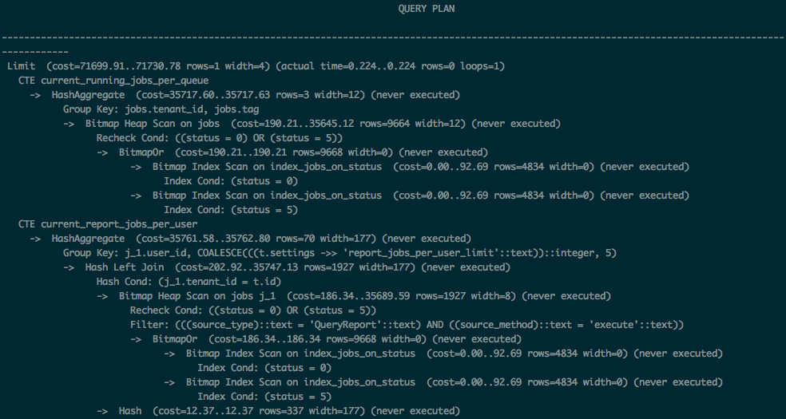
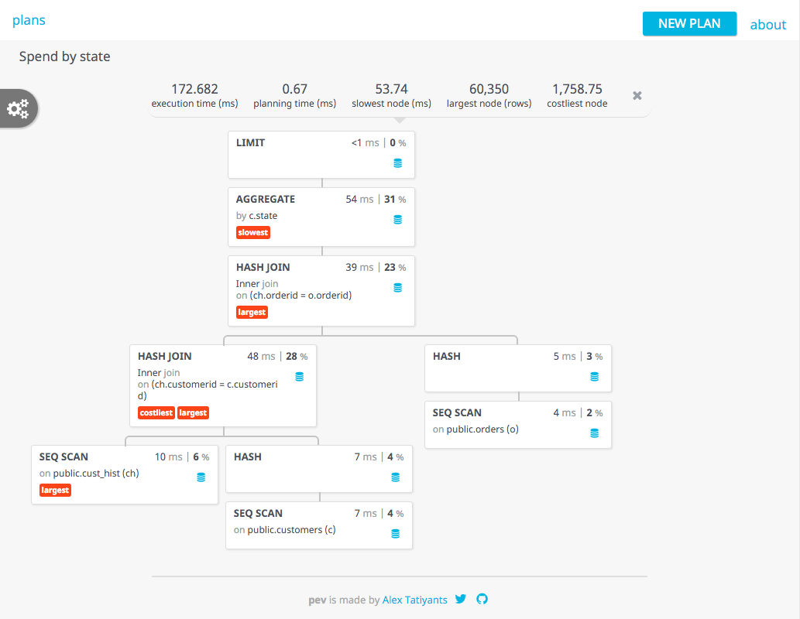
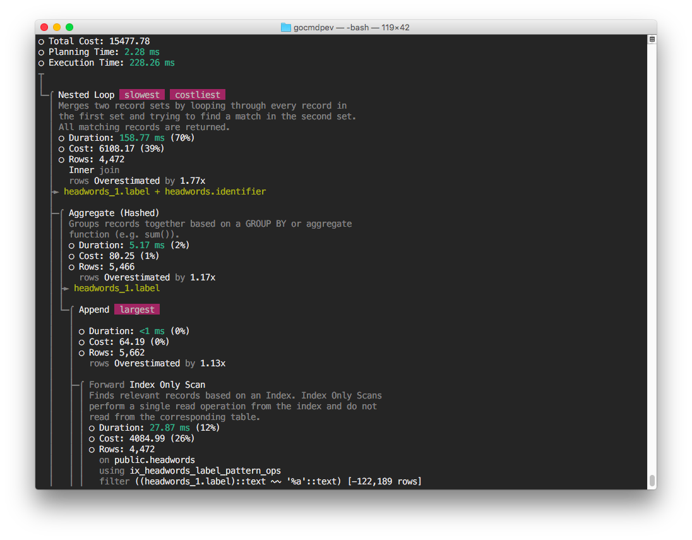
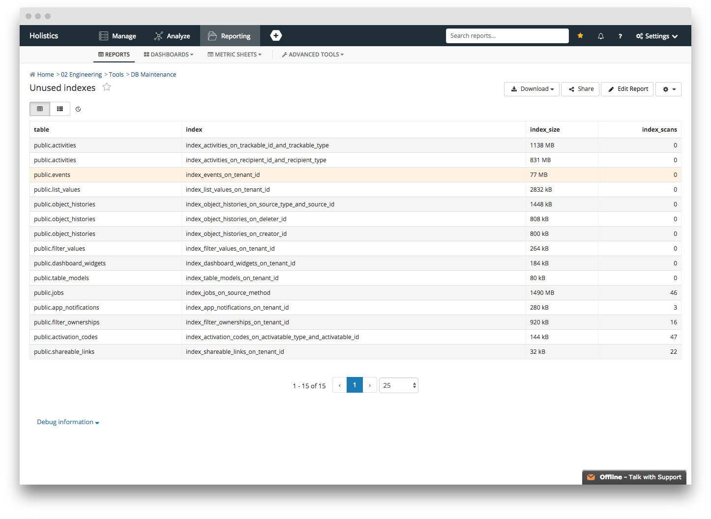
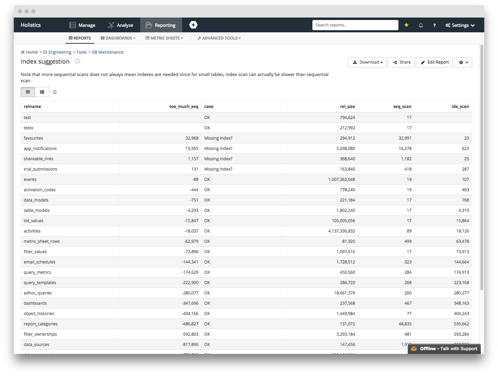

---
## Our Experience Optimizing A Rails + PostgreSQL App
---
### Introduction
---
### Holistics

* Data analytics/BI platform
* Rails/Sidekiq/PostgreSQL
---
### Why PostgreSQL?

* Support of JSON
* Support of CTE
* Advanced index types
---
### My web app is slow! Where to start?
---
### The journey of a thousand miles start with...
---
### ...tracking
---
### Things to track
* Rails log
* Events log
* Database log
* Server log (CPU/memory/disk/network etc.)
---
### Tools
* ELK stack
* Tracking provided by hosting services (AWS/DO/GCP/Azure...)
* Graphite/Graphana
* Commercials: New Relic/DataDog/Scout/etc.
* Query visualization tools: Holistics
---

---

---
### What is slow?
* Reported by customers
* Alerts from monitoring tools
---
### Summary statistics
* Mean: 250ms
* Standard deviation: ~200ms
* 95th percentile: ~1200ms
* 99th percentile: ~18000ms
---?image=static/summary_statistics.gif&size=auto 90%
---
### Folder structure navigation is very slow

---
Scout shows that `/cats/<cat_id>/children.json` endpoint is:
* sending out ~200 of database queries per request
* db queries responsible to 80% of request duration
---
### Classic n + 1 problem
Query to retrieve all folders under current one

    select * from folders where parent_id = $1

For each of them, retrieve permissions, users shared, last action, etc:

    select * from permissions where folder_id = $1
    select * from users where permission_id = $1
    select * from events where user_id = $1

For each child folder, repeat the same process
---
### How to detect/solve n + 1 problem with ActiveRecord?
* Detection: bullet gem (https://github.com/flyerhzm/bullet)
* Eager loading
* Custom query using Arel
---
### Example

	class SharedFilter < ActiveRecord::Base
      belongs_to :tenant
	  has_one :object_lock
	  has_many :reports
	  has_many :dashboards
	end
---
### Eager loading

	SharedFilter
	  .where(tenant_id: tenant_id)
	  .include(:object_locks, :reports, :dashboards)
---
### Eager loading

Number of queries: 4

    select * from shared_filters where tenant_id = $1
    select * from object_locks where filter_id = $1
    select * from reports where id in ($1)
    select * from dashboards where id in ($1)
---
### Custom query with scopes

    SharedFilter
      .filter_tenant(tenant.id)
      .select_all
      .include_object_locks
      .include_report_count
      .include_dashboard_count
---
### Scopes implementation

    def select_all
      select("#{self.table_name}.*").group("#{self.table_name}.id")
    end
  
    def active
      where('deleted_at IS NULL')
    end
  
    def filter_adhoc(bool)
      where("#{self.table_name}.is_adhoc = ?", bool)
    end
---
### Scopes implementation (cont.)

    def include_object_locks
      select('object_locks.id as object_lock_id')
        .joins("LEFT JOIN object_locks ON #{self.table_name}.id = object_locks.subject_id AND object_locks.subject_class = '#{self.to_s}'")
        .group('object_locks.id')
    end

    def include_report_count
      select('count(NR.id) as report_count')
        .joins("LEFT JOIN filter_ownerships NR ON NR.shared_filter_id = shared_filters.id AND NR.filterable_type = 'QueryReport'")
    end

    def include_dashboard_count
      select('count(ND.id) as dashboard_count')
        .joins("LEFT JOIN filter_ownerships ND ON ND.shared_filter_id = shared_filters.id AND ND.filterable_type = 'Dashboard'")
    end
---
### Scopes implementation

Number of queries: 1
---
### Hieriarchical query

* Retrieve ancestor folders of a report
* Retrieve descendants of a folder
---
### Example

    class Folder < ActiveRecord::Base
      has_one :parent
    end
    
    class Report < ActiveRecord::Base
      has_one :parent_folder
    end
---
### Normal implementation

    def ancestors(report)
      return [] unless report.folder.present?
      folder = report.folder
      while folder.present?
        res << folder
        folder = folder.parent
      end
      res.reverse
    end
---
### The recursive CTE way

    with recursive tree as (
      select R.parent_id as id, array[R.parent_id]::integer[] as path
      from #{Folder.table_name} R
      where id = #{folder_id}

      union

      select C.parent_id, tree.path || C.parent_id
      from #{Folder.table_name} C
      join tree on tree.id = C.id
    ) select path from tree
    where id = 0
---
### My query is still slow. Now what?
---
### Debugging query performance
---
### EXPLAIN ANALYZE

---
Postgres Explain Visualizer: http://tatiyants.com/pev/

---
Commandline visualizer: https://github.com/simon-engledew/gocmdpev

---
### Fixing performance
* Run vacuum/analyze on slow tables
* Rewrite queries
* Adding indexes
---
### Vacuum/analyze
* Vacuum: clean up dead rows from disk
* Analayze: Update statistics on table for accurate query planning
* Reduce one complex query from mean 2000ms -> 100ms
---
Custom autovacuum/autoanalyze frequency

    ALTER TABLE <table> SET (autovacuum_vacuum_scale_factor = 0.0);
    ALTER TABLE <table> SET (autovacuum_vacuum_threshold = 1000);
    ALTER TABLE <table> SET (autovacuum_analyze_scale_factor = 0.0);
    ALTER TABLE <table> SET (autovacuum_analyze_threshold = 1000);
---
Vacuum/analyze every (number of table rows * scale_factor + threshold) rows got inserted/updated/deleted
---
### Rewrite queries
* Move filtering inside CTE
* Avoid SELECT DISTINCT on whole table
---
### Adding indexes
Remember to set algorithm: concurrently

    add_index :users, :tenant_id, algorithm: :concurrently
---
### Expression index

    # Query
    User.where("LOWER(email) = LOWER(?)", params[:email])

    # Adding index
    class IndexUsersOnLowerEmail < ActiveRecord::Migration
      def up
        execute 'CREATE INDEX users_on_lower_email ON users(LOWER(email))'
      end
    end
---
### Partial index

    SELECT COUNT(*)
    FROM event
    WHERE
      (data->>'type') = 'submit' AND
      (data->>'path') = '/signup/' AND
    time BETWEEN 1409554800000 AND 1410159600000
---

    CREATE INDEX event_signups ON event (time)
    WHERE (data->>'type') = 'submit' AND (data->>'path') = '/signup/'
---
### Trigram index
* Speed up LIKE/ILIKE query
* Example: https://about.gitlab.com/2016/03/18/fast-search-using-postgresql-trigram-indexes/
* Reduce search time ~20ms -> ~1ms
---

    # Query
    select title from query_reports where title ILIKE '%some%text%'

    # Adding index
    class AddGinIndexToReportsTitle < ActiveRecord::Migration
      def up
        execute 'create extension if not exists pg_trgm'
        execute 'CREATE INDEX IF NOT EXISTS index_query_reports_on_title_trigram\
        ON query_reports USING gin (title gin_trgm_ops);'
      end
    end
---
### Index tradeoff
* Extra time to do INSERT/UPDATE/DELETE
* Extra disk space needed
---
### Useful queries
---
Unused indexex: https://gist.github.com/9diov/fa9c7f41b92f8e8c528ff9184a2b4e15

---
Index suggestion: https://gist.github.com/9diov/6174289564ba4ee0f296974ca3638024

---
## Question?
