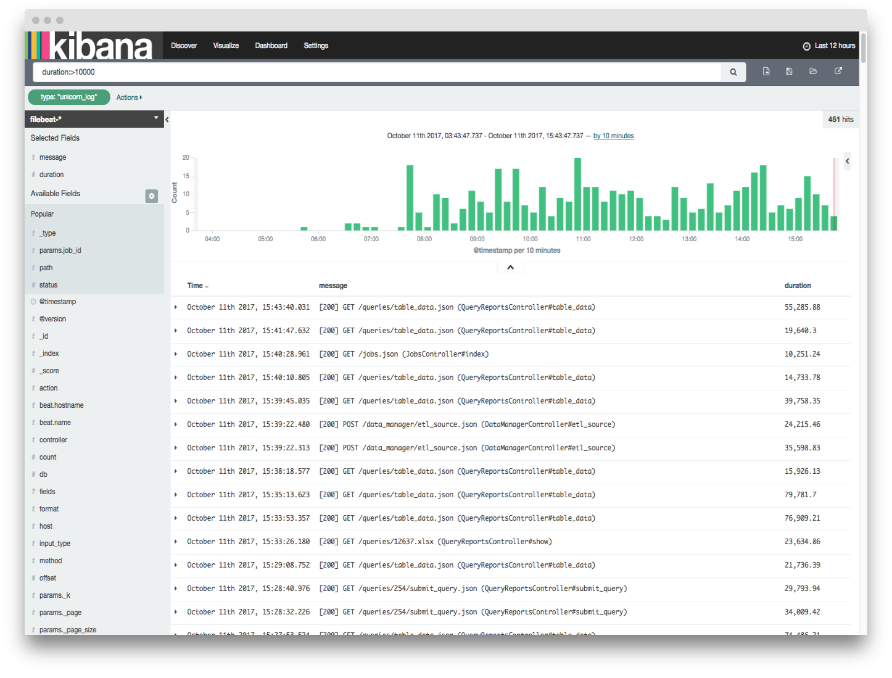

---
# Our Experience Optimizing A Rails + PostgreSQL App
---
## Introduction
---
## Holistics

* Data analytics/BI platform
* Rails/Sidekiq/PostgreSQL
---
## Why PostgreSQL?

* Support of JSON
---
## My web app is slow! Where to start?
---
## The journey of a thousand miles start with...
---
## ...tracking
---
## Things to track
* Rails log
* Events log
* Database log
* Server log (CPU/memory/disk/network etc.)
---
## Tools
* ELK stack
* Tracking provided by hosting services (AWS/DO/GCP/Azure...)
* Graphite/Graphana
* Commercials: New Relic/DataDog/Scout/etc.
* Query visualization tools: Holistics
---

---

---
## What is slow?
---
## Folder structure navigation is very slow

---
## Summary statistics
* Mean: 250ms
* Standard deviation: ~200ms
* 95th percentile: ~1200ms
* 99th percentile: ~18000ms
---
Scout shows that `/cats/<cat_id>/with_children.json` endpoint is:
* sending out up to 200 of database queries per request
* db queries responsible to 80% of request duration
---
## Classic n + 1 problem
* Query to retrieve all folders under current one

    select * from categories where parent_id = $1
* For each of them, retrieve permissions, users shared, last action, etc:

    select * from permissions where source_id = $1
    select * from users where permission_id = $1
    select * from events where user_id = $1
* For each child folder, repeat the same process
---
## How to solve n + 1 problem with ActiveRecord?
* bullet gem (https://github.com/flyerhzm/bullet)
* Eager loading
* Custom query using Arel
---
## Example

	class SharedFilter < ActiveRecord::Base
      belongs_to :tenant
	  has_one :object_lock
	  has_many :reports
	  has_many :dashboards
	end
---
## Eager loading

	SharedFilter
	  .where(tenant_id: tenant_id)
	  .include(:object_locks, :reports, :dashboards)
---
## Eager loading

Number of queries: 3
* `select * from shared_filters where tenant_id = $1`
* `select * from reports where id in ($1)`
* `select * from dashboards where id in ($1)`
---
## Custom query with scopes

    SharedFilter
      .filter_tenant(tenant.id)
      .select_all
      .include_object_locks
      .include_report_count
      .include_dashboard_count
---
## Scopes implementation

    def select_all
      select("#{self.table_name}.*").group("#{self.table_name}.id")
    end
  
    def active
      where('deleted_at IS NULL')
    end
  
    def filter_adhoc(bool)
      where("#{self.table_name}.is_adhoc = ?", bool)
    end
---
## Scopes implementation (cont.)

    def include_object_locks
      select('object_locks.id as object_lock_id')
        .joins("LEFT JOIN object_locks ON #{self.table_name}.id = object_locks.subject_id AND object_locks.subject_class = '#{self.to_s}'")
        .group('object_locks.id')
    end

    def include_report_count
      select('count(NR.id) as report_count')
        .joins("LEFT JOIN filter_ownerships NR ON NR.shared_filter_id = shared_filters.id AND NR.filterable_type = 'QueryReport'")
    end

    def include_dashboard_count
      select('count(ND.id) as dashboard_count')
        .joins("LEFT JOIN filter_ownerships ND ON ND.shared_filter_id = shared_filters.id AND ND.filterable_type = 'Dashboard'")
    end
---
## Scopes implementation

Number of queries: 1
---
## Hieriarchical query

* 
---
## Question?
