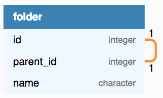

---
Hierarchical data in relational database
---
### Agenda
* Introduction
* Adjacency list
* Closure table
* Nested set
* Database specific implementations
* Conclusion
---
### Part 1: Introduction
* What is hierarchical data?
* Why stores in relational database?
* Common ways to store hierarchical data in relational database
+++
### What is hierarchical data?
Data that has parent-child relationship such as

* File system: directory - child
* Forum post
+++
### File system

+++
### Forum post

+++
### Why stores in relational database?
* No additional database needed
* Can join together with other types of relational data
+++
## Common strategies
* Adjacency list
* Closure table
* Nested set
+++
### End of part 1
---
### Agenda
* Introduction
* @color[#D33682](Adjacency list)
* Closure table
* Nested set
* Conclusion
---
### Part 2: Adjacency list
+++
@snap[north-west]
<h4>Adjacency list</h4>
<ul>
	<li>Each node has a pointer to its' parent</li>
</ul>
@snapend

@snap[north-east right-diagram]

@snapend
+++
### End of part 2
---
### Agenda
* Introduction
* Adjacency list
* @color[#D33682](Closure table)
* Nested set
* Conclusion
---
### Part 3: Closure table
+++
### End of part 3
---
### Agenda
* Introduction
* Adjacency list
* Closure table
* @color[#D33682](Nested set)
* Conclusion
---
### Part 4: Nested set
+++
### End of part 4
---
### Agenda
* Introduction
* Adjacency list
* Closure table
* Nested set
* @color[#D33682](Conclusion)
---
### Conclusion
---
### Questions?

